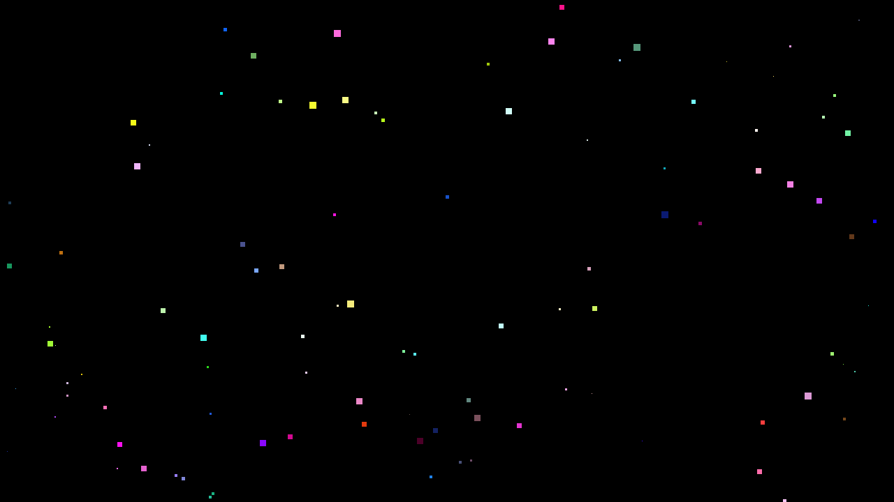
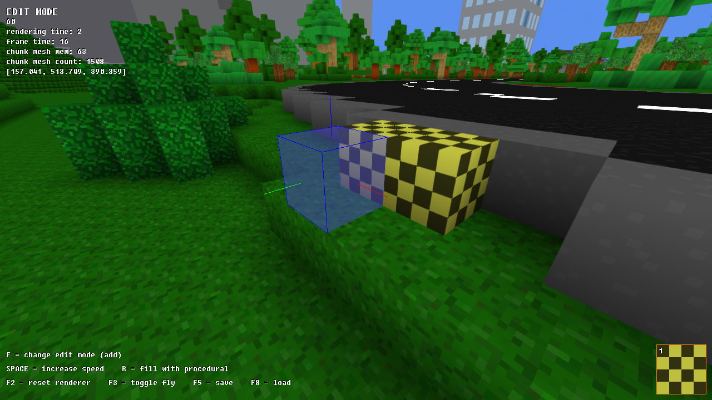

# We are Made of Dreams
###### OpenGL [demo](http://en.wikipedia.org/wiki/Demo_%28computer_programming%29) written in [D](http://dlang.org/), with music by [Links](https://soundcloud.com/lnks)
[](https://vimeo.com/223964278)

## Features
* Integration of D code with C libraries (WinAPI, X11, Freetype, libjpeg, libpng, OpenAL, OggVorbis)
* Native OpenGL graphics on Windows and Linux
* Minecraft like 3D engine
* Octree based world with multithreaded meshing
* Embedded editor for creating maps

## Compilation

### Windows
Install:
1. [Digital Mars D Compiler](http://dlang.org/)
2. [Visual Studio](https://www.visualstudio.com/)
3. [Visual D](http://rainers.github.io/visuald/visuald/StartPage.html)
4. [OpenAL](https://www.openal.org/)

Open the Visual Studio solution `dreams.sln` and compile all projects

### Linux
Install the required dependencies (Debian\Ubuntu):
```sh
sudo apt install libfreetype6-dev
sudo apt install libgl1-mesa-dev libx11-dev
sudo apt install libjpeg-dev
sudo apt install libogg-dev libvorbis-dev
sudo apt install libopenal-dev
sudo apt install libpng-dev
# Digital Mars D Compiler
curl -fsS https://dlang.org/install.sh | bash -s dmd
```
Compile the project with `make`

## Editor
To enable the editor, execute the application with the `-editor` parameter.

[](https://vimeo.com/223965507)

## World structure
The world is an Octree of chunks. A chunk is a 16x16x16 matrix of blocks. A block is the smallest unit indexable in the three-dimensional space (x, y, z). A block is represented graphically as a cube.

Relevant source files:
* [`world.d`](src/dreams/world.d): world octree structure
* [`world_mesh.d`](src/dreams/world_mesh.d): generates the mesh of a chunk
* [`world_renderer.d`](src/dreams/world_renderer.d): asynchronically generate the meshes for the visible chunks and renders them
